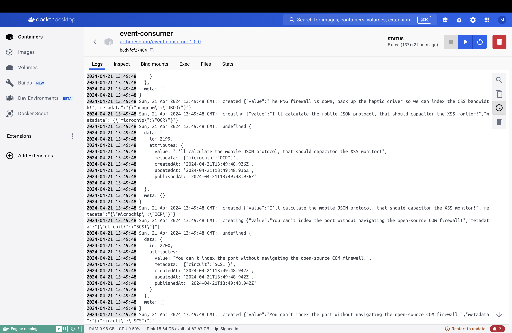
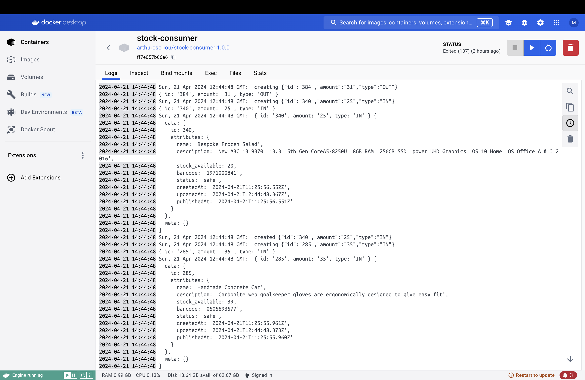

# Projet DataOps

Ce projet consiste en la réalisation  d'une application de gestion de stock d'un magasin.


## Contributeurs

- Michelle SONG 21106878 ([@misoop](https://github.com/misoop))
- Camelia BOUALI 21108238 ([@cmla16](https://github.com/cmla16))
- Arthur ESCRIOU (chargé du projet)


## Prérequis

Avant de commencer, assurez-vous d'avoir les éléments suivants installés sur votre machine :

- Docker

- Node.js : Seules les versions [Active LTS et Maintenance LTS](https://nodejs.org/en/about/previous-releases) sont compatibles avec Strapi (actuellement v18 et v20)

- Votre gestionnaire de paquets Node.js préféré :
    - [npm](https://docs.npmjs.com/cli/v6/commands/npm-install) (v6 ou version ultérieure)
    - yarn

## Instructions de lancement

Pour lancer les services de l'application, placez-vous dans le répertoire contenant le fichier **docker-compose.yml** et exécuter la commande suivante : 

```bash
  docker compose up
```

ou bien, exécutez le fichier **script.sh** qui est fourni.

Ouvrez http://localhost:1337 pour accéder à l'interface de Strapi. Pour visualiser dans le navigateur ouvrez http://localhost:5174. 

## Architecture

Notre système comprend les conteneurs suivants:

- **strapiDB** : Contenant la base de données PostgreSQL utilisée par Strapi, créé à partir de l'image **arthurescriou/strapi-pg:1.0.0**.

- **strapi** : Contenant le projet Strapi, créé à partir de l'image **arthurescriou/strapi:1.0.0**.

- **strapi-frontend** : contenant la partie front de l'application, créé à partir du dossier `opsci-strapi-fontend` par Arthur Escriou.

- **zookeeper** et **kafka** , qui sont créés à partir des images **wurstmeister/zookeeper:latest** et **wurstmeister/kafka:2.11-1.1.1**, permettent de stocker et traiter des flux de données.


- **product-producer** et **product-consumer** qui sont créés à partir des images **arthurescriou/product-producer:1.0.0** et **arthurescriou/product-consumer:1.0.3**.

- **event-producer** et **event-consumer** qui sont créés à partir des images **arthurescriou/event-producer:1.0.3** et **arthurescriou/event-consumer:1.0.0**.

- **stock-producer** et **stock-consumer** qui sont créés à partir des images **arthurescriou/stock-producer:1.0.1** et **arthurescriou/stock-producer:1.0.1**.


Les producers vont fournir des données (product, event et stock) à Kafka et les consumers vont les lire.


L'ensemble des images utilisées sont disponibles sur [Docker Hub](https://hub.docker.com/)
## Demo

Vous trouverez le screencast présentant les codes et les différentes fonctionnalités de l'application dans le fichier `dataops-screencast-final.mov`.
## Screenshots et logs




